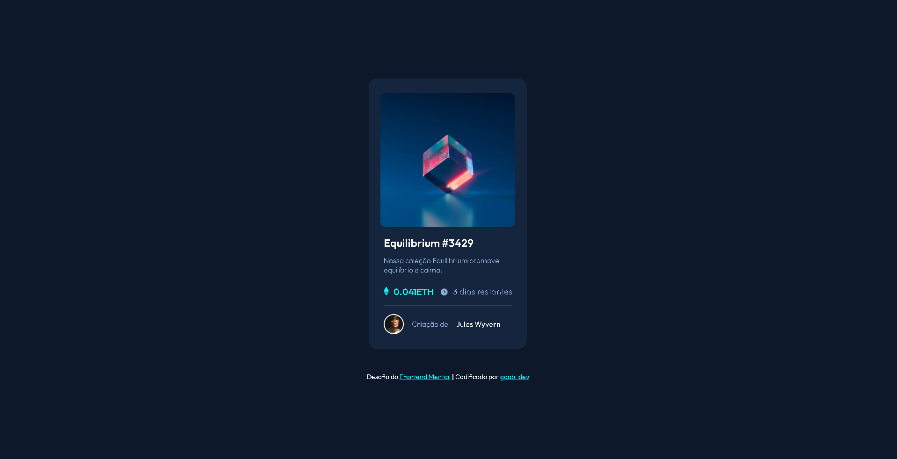

### Preview

    

## Visão geral
Esta é uma solução para o [Desafio do componente do cartão de visualização NFT no Frontend Mentor](https://www.frontendmentor.io/challenges/nft-preview-card-component-SbdUL_w0U).

### Links
- URL do site ao vivo: [Frontend Mentor | NFT Componente do cartão de visualização]()

### Tecnologias
- HTML5
- CSS
- Flexbox
- Git e Github

## Autor
- Frontend Mentor - [@gabyzinha72](https://www.frontendmentor.io/profile/gabyzinha72)